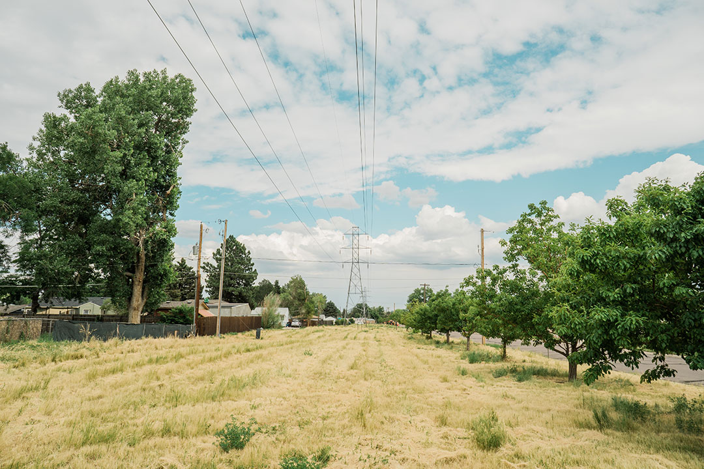
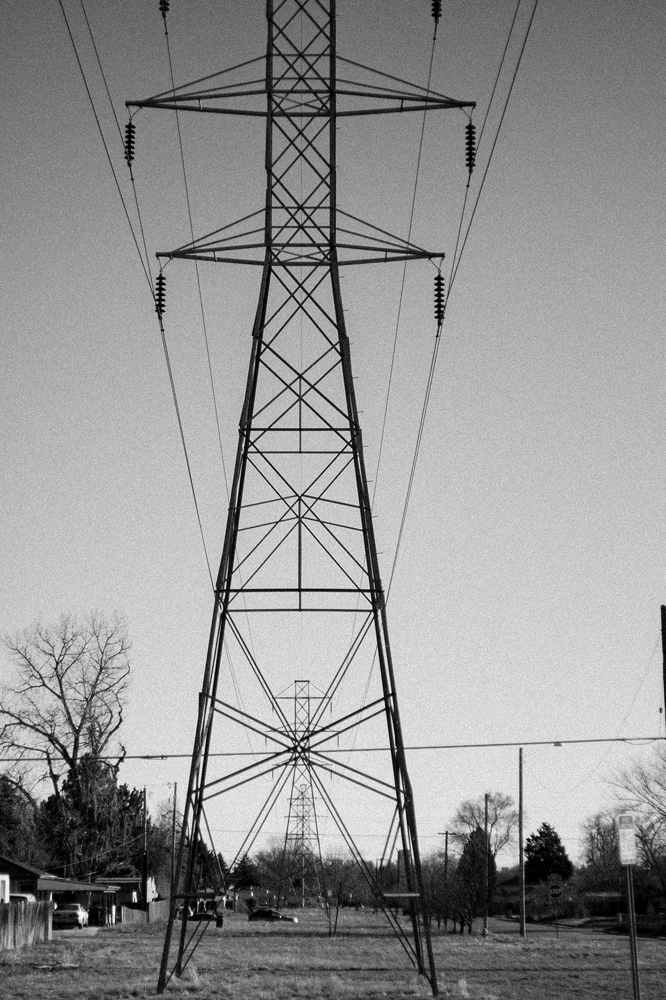

## Using Hashes for Headings

Hashes (#) are used to tag various headers. One "#" followed by a space connotes an "H1" header. Two "##" followed by a space connotes "H2" header, and so on. See the examples below:

# This is an H1 header.

## This is an H2 header.

### This is an H3 header.

#### This is an H4 header.

By assigning headers in Markdown with this hashing system, you are creating structure, hierarchy, and navigability to your content. Think of the H1 as a section title, H2 as a subsection title and so on. Your headers create a table of contents or an outline your resource so others will have an easier time accessing your work. As such they should be direct and descriptive of the context they contain. Markdown can be exported to a wide range of document types, for our purposes we will be using markdown to render a webpage of your resource. Therefore the exact styling of each header (ie font, font size, etc) will be controlled by the styling provided for all resources within the repository (for those familiar with web development, the website will use CSS to style the headers which become the equivalent h1, h2 etc tags in html).

## format in-line text by adding emphasis

Just as in word processors you can use inline formatting, such as **bold** or _italic_ text

- **your text** -- yields bold text
- _your text_-- yields italic text

## Adding images

Adding images is an important way to bring visual depth to your content. Ensuring your images show consistently can be tricky. To maximize the accessibility of your content for the broadest range of online readers, You will resize, crop, rename, caption, provide alt-text for, and site each of the photos you will include in your resource. By taking the extra time to complete these steps you will ensure the photos load quickly, consistently, and with descriptive text for those who use assistive devices. You will also credit the labor or others by providing appropriate citations for their visual work.

If you do not have access to popular proprietary image editing software like Photoshop, we recommend downloading and using free and open source alternatives like [gimpy](https://www.gimp.org/) otherwise you may use web based tools that will be described below .

### Preparing images

To demonstrate this process I will use two images a graphic image (.jpg)

[alt-text][ref]

[ref]: ./assets/2023-06-26-markup-example-park-perspective-authored.jpg

And a non-graphic image (.png)

#### crop your images

When possible, We ask that your images are in 4:3 (landscape), 3:4 (portrait), or 1:1 (square). If you are using an image from another source their is no need to crop the image.

If you do not have software to crop your images, [this website]() allows you to upload, crop, and download images.

#### resize your images

We ask that all images be resized to 1080 pixels by 810 pixels for landscape and portrait and 1080 pixels by 1080 pixel for square images. Each image should be no larger than 500kb. There are different strategies for optimizing your images for the web the differ slightly depending on whether your image has graphic (ie has a primarily vector or line based composition such as a diagram or illustration) or is not (ie raster images such as digital photographs). Below we provide some guidelines for maximizing the legibility of your images.

##### graphic images

##### non-graphic images

#### Renaming images

#### sourcing and referencing images

### Adding Images to your resource

So that we don't ever run into broken or missing links, we ask that you upload all of the images that will be included in your resource as individual jpg or or png files with descriptive names that include both your resource title and an identifying label (ie diagram-of-theory or documentation-of-workshop etc) as well as a notation if the image was authored or sourced externally. Generally the images should be date-title-description-source.jpg(or png). If your description is multiple words, add dashes between them and be sure that they are lower case. While there are several viable ways to include images in your document, the process we outline below is recommended for ease of drafting your resource document and also verifying that your references matched. We recommend the following two step process:

1. Add inline text tag with descriptive text reference.
2. Add reference link to the end of your document.

##### adding online text tag

All images tags will start with a "!" Followed by two sets of square brackets "[]". Inside the first set, you include the alt-text which is the descriptive text that a speech reader will provide (ie "a vendiagram with three overlapping circles titles landscape architecture, agriculture, horticulture "). The alt-text can be as long or as short as you like. In general we advise... (reference to best practices) Inside the second square brackets you include your description that you used to label the image (ie. [diagram of theory]. For our example would be

To be sure that your image loss properly, you need to add a reference to the end of your document which connects the inline label with the location where your image is saved. This is your reference link.

##### adding reference link

The syntax for adding the reference includes to parts, the reference label, in our case "diagram of theory", and a map to the location where the image is saved relative the the website. In our case then map will include references that are a part of the back process the buildings the website from the folder you submit. , a reference to folder name that you will submit (which is the submission year-submission month-submission title as slug.

2023-09-my-title/assets/2023-09-my-title-authored

In this way you can quickly verify that all your links and references are correct and each include appropriate paths. You can move the the tag within the document without needing to update the link. You may also use the same image more than once by including the same reference more than once.

#### Try downloading pdfs

[my pdf for download][1]

[1]: ./assets/2023-06-markup-example-electric-tower-authored.jpg
