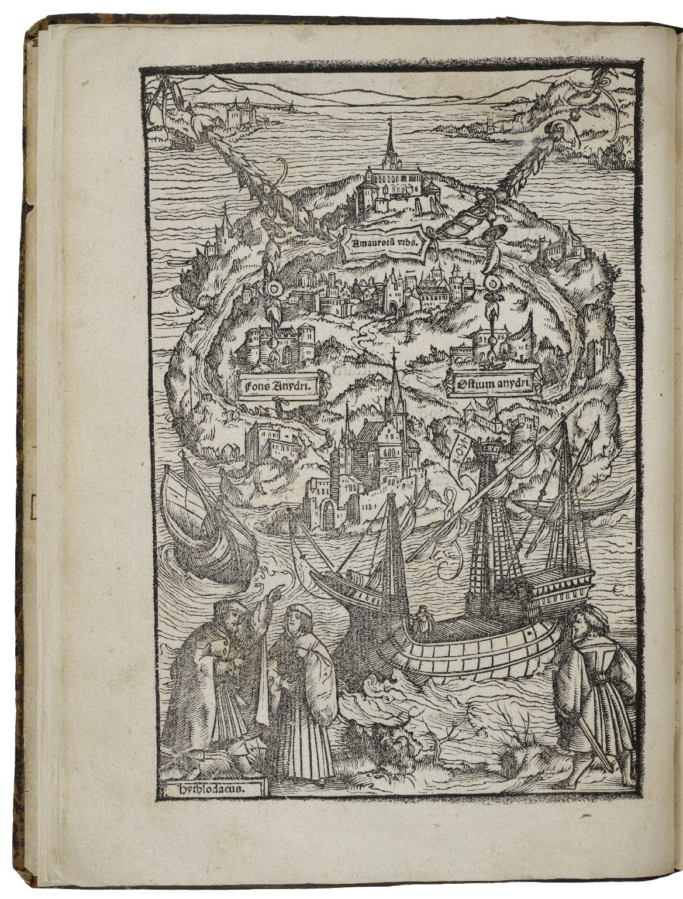

In this document we will provide examples of formatting and referencing that we recommend for you resource submission. You may edit this document with your own content by to get familiar with the mechanics.

Before you begin editing this document and adding your own content, please referred to the `markdown-explainer.md` and the `markdown-cheatsheet.md` files included in the same downloaded folder, please start there before returning here.

Remeber that the styling you see in your Markdown editor is not the syling that will render on the website. The website style each resource consistently based on css built into the website.

## How to Use Headings

`# H1 Should be used for your title.`

Remember that your title will render from your provided "frontmatter" on the website page, so including it again in your document is optional.

`## H2 Should be used for sections of your resource.`

H2 Headings will provide the primary backbone of structure of your document.

`### H3 Should be used for sub-sections of your resource.`

`##### H5 Should be used for auxilary sections like Footnotes, Bibliogrpahy, etc`

## Footnotes and Figure Footnotes

We encourage footnoting to provide extra context to your writing when appropriate. You manually add note references within square brackets with the reference preceded by a carrot ("^"). The footnote reference will look like this `[^Your-Text-Without-Spaces]`. To complete the footnote, add the same reference followed by a colon `[^Your-Text-Without-Spaces:` and your footnote text at the end of your document. The footnote will automatically by hyperlinked so that the reader can got to the footnote and immediately return to where the footnote is referenced in the main text. Test it in the footnote following this sentence[^1]. You will note that these references are technically "endnotes" as they appear at the bottom of the entire document. If your resource is printed via pdf, however, all your footnotes will be added as proper footnotes at the end of each page. Also note that all footnotes will be renumbered based on order regardless of why your annotations are. Using `Fig-1` format is to help you keep track of which reference require citation.

## Adding, Captioning, and Citing Images

_Unlike Thomas More's utopian representations, above in a woodcut illustration from a 1518 print of his book "Utopia", we focus on a process and believe that utopias could be anyplace [^Fig-1]_

_You can add a caption to your image by following the image tag with your text surrounded it with a single astrisk on the line immediately below the image tag, like this. You should also footnote your images here [^Fig-2]_

Try adding your own image below with a caption:

## Adding Links to External Websites

## Adding Links to Internal Downloadable PDFs and Other Resources.

You may wish to include additional resources that you have created or used that are in other formats (pdfs, powerpoints, etc).
You may add links to download these materials by linking to the appropriate relative path. We request that you add the appropriate folder to the content in the an `asset` folder in your main folder directory. By using the same relative path, it will make your links easier to manage and help our team help you touble shoot if there are any issues.

[Pdf of my presentation](./assets/pdfs/2023-example-resource_Pedagogy-of-Potential_Martin_2022.pdf)

##### Footnotes:

##### Figures Footnotes:

[^1]: Click the small linked return symbol at the end of this note to return to the primary text.
[^Fig-1]: Scanned woodcut representation by Amborius Holbein from the 1518 edition of Thomas More's _Utopia_, Public Domain
[^Fig-2]: Image originally posted by Bob Haarmans on Flickr,[https://flickr.com/photos/24204960@N03/36985565915], Licensed under Creative Commons.
